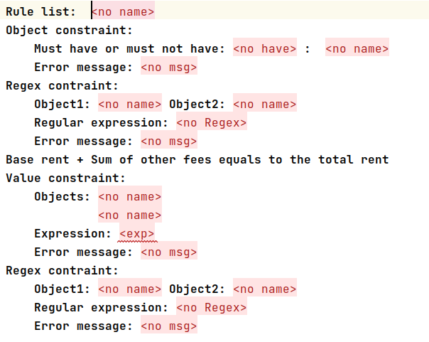
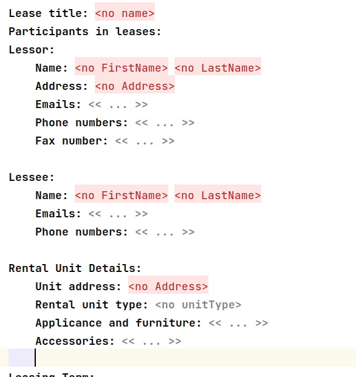
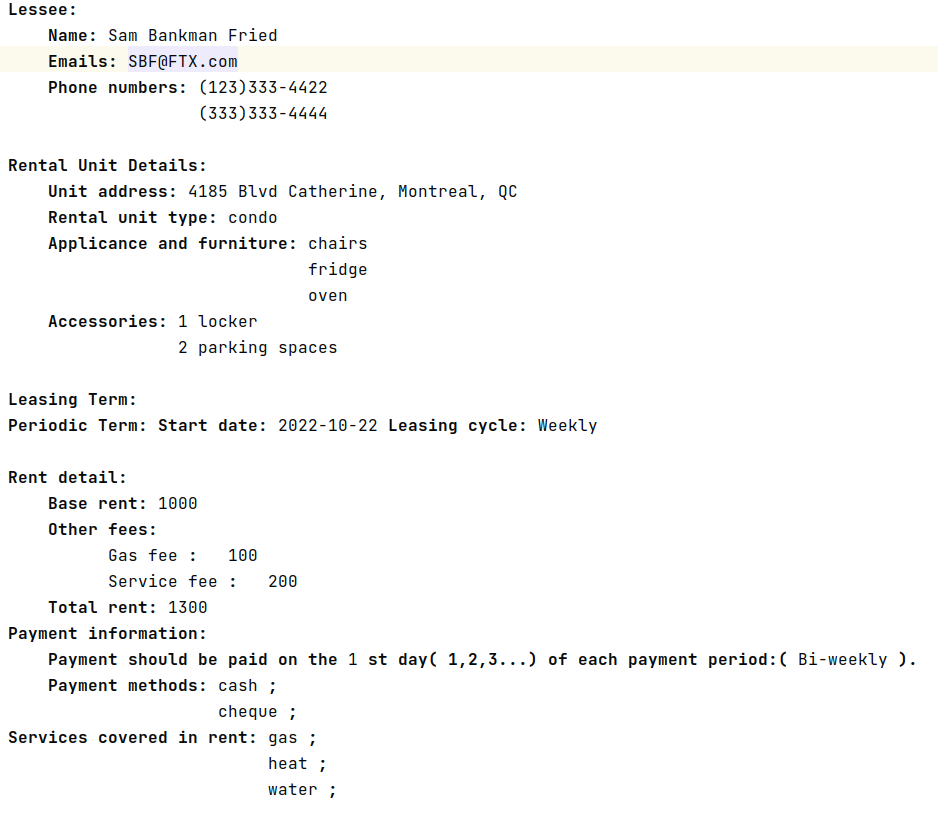
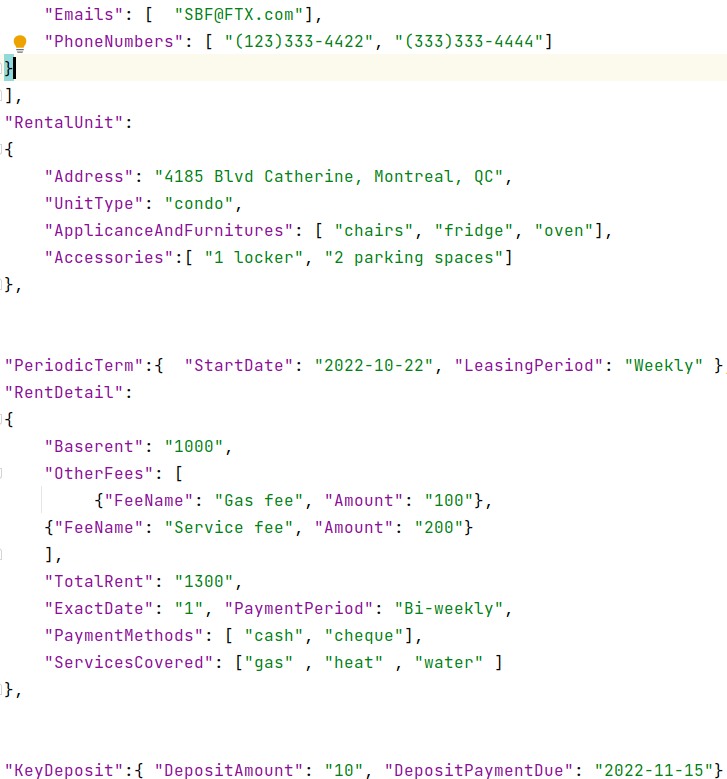
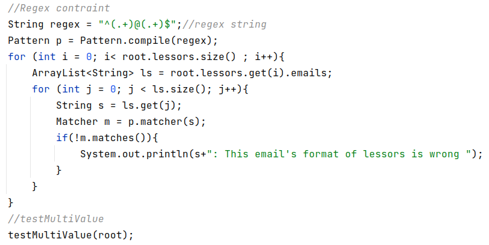
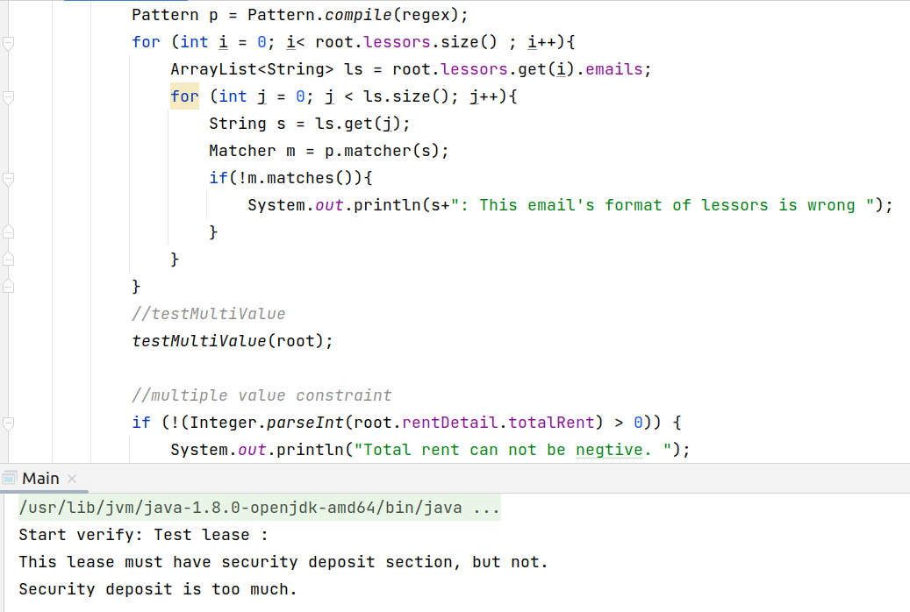

# DSL4Lise

DSL4Lise is a a group of DSL(domain specified language) tools for residential lease generation and verification. Currently, there are 2 dsls listed in this project:

- AliceGen: an dsl language provides a form-like interface for users to generate lease contracts and exports the lease metadata in json format.
- AliceVerify: a dsl lanuage provides a user-friendly text-based interface to generate lease verification code in java.

## AliceGen

AliceGen is a residential lease generation tool based on the Core ontology of residential leases(https://github.com/Vieloooo/Lease_OT). It consists of two parts:

- LangAliceGen: the domain specified language behind AliceGen. This Dsl targets the residential leasing domain, which provides the based syntax to create a new residential lease.
- LangAliceGen.sandbox: A interface for users to generate and export residential leases. This provides two main functions:
  - A dynamic form which let users to create new blocks and fill the blanks.
  - An text generator which can serialize residential lease instances to Json files.

### LangAliceGen Implementation

- concepts:The concepts of LangAliceGen is directly mapped from the core ontology of residential leases.The core ontology is formed in class diagram, so each class is mapped to a single concept in Jetbrains MPS.
- concrete syntax: using LangAliceGen is similar to create objects in OOP. Users can create new forms based on our concept templates.

## AliceVerify

AliceVerify is a DSL interface for users to generate Java code which can be used to verify the residential lease forms generated by AliceGen. Users can use LangAliceVerify to set the contraints of residential leases in a much easier way than writing java code directly.

### LangAliceVerify Implementation

- Type of constraints: There are basically three types of constraints which rules leases: 
  - Value constraints: Rule the relationshiops between numeric properties in leases. 
  - Regular expression constraints: restrict the type of string properties in lease. 
  - Object constraints: restrict if a object can be included in the current lease.
- concrete syntax: 
    - 
## Example: How to use our tools to create lease forms and verify them

- Launch AliceGen sandbox, which provides a dynamic form and we can choose different blocks. By editing the dynamic form, we can generate a new form.
    - Blank form:
      - 
    - Filled form:
      - 
- After finish building the lease,  we can export our new-built lease to json using the Text Generator provided by LangAliceGen. 
  - Json file: 
- Move to the AliceVerify, lets write some constraints for our new-built leases: We can choose 4 types of rules and construct them freely. 
  - 
- export verification java code
  - 
- put the json file and verification java code to running evironment and execute the verification code, we can see that the verification results are printed in the terminal: 
  - 

## Future work

